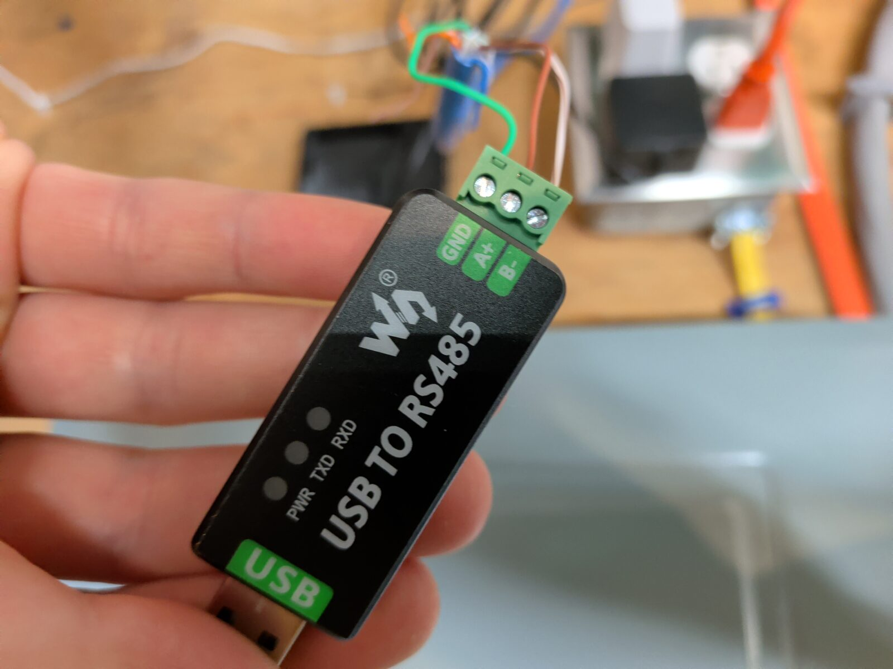
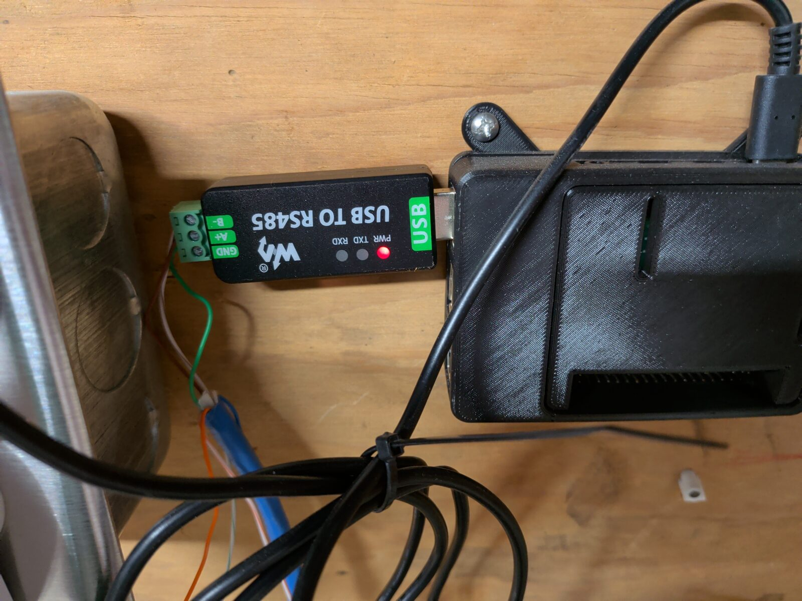
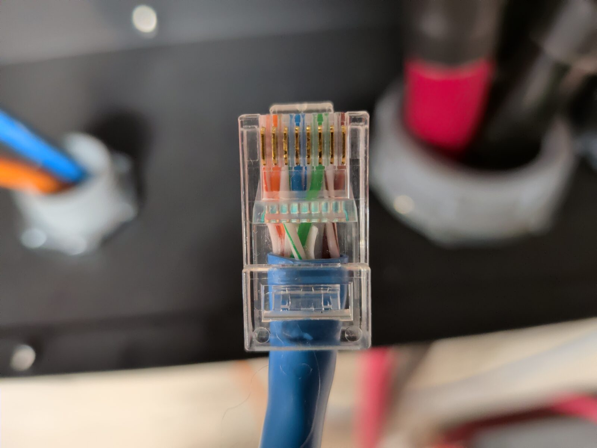
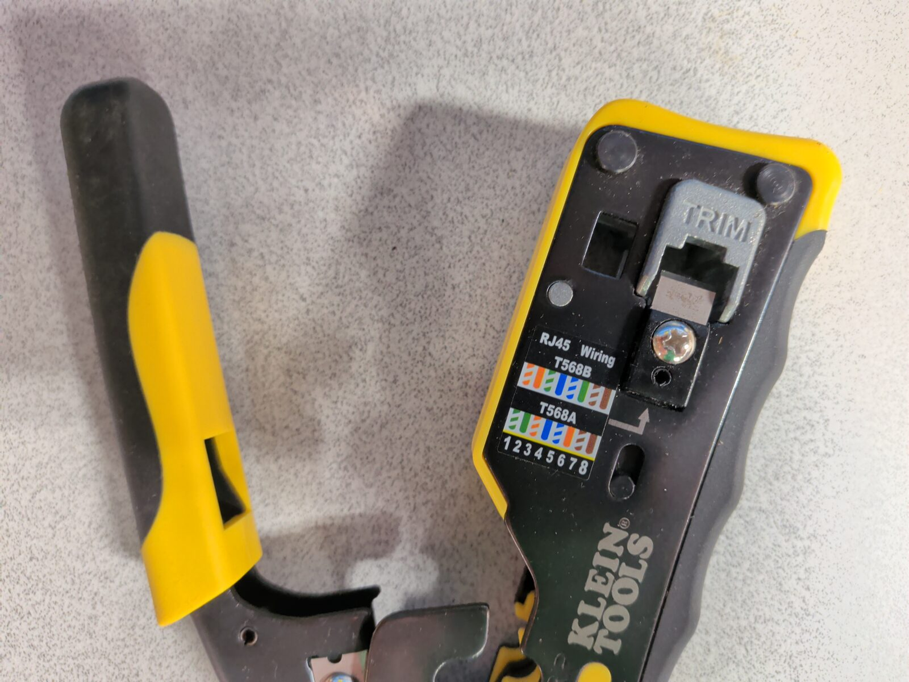
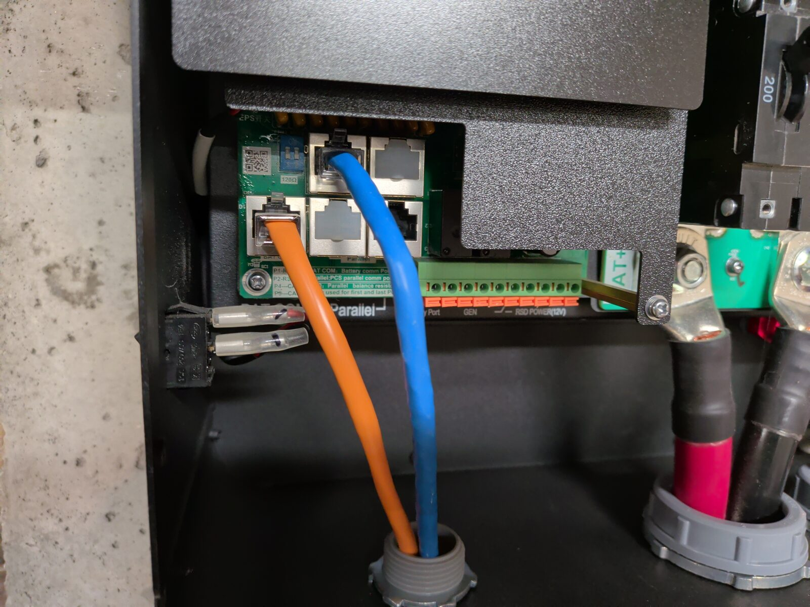
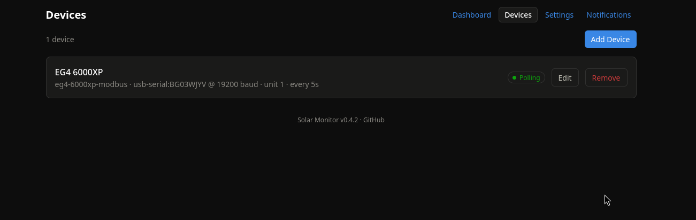
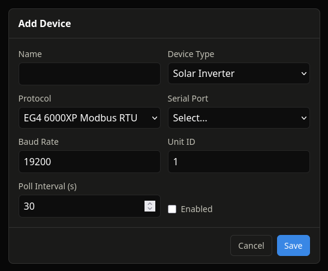
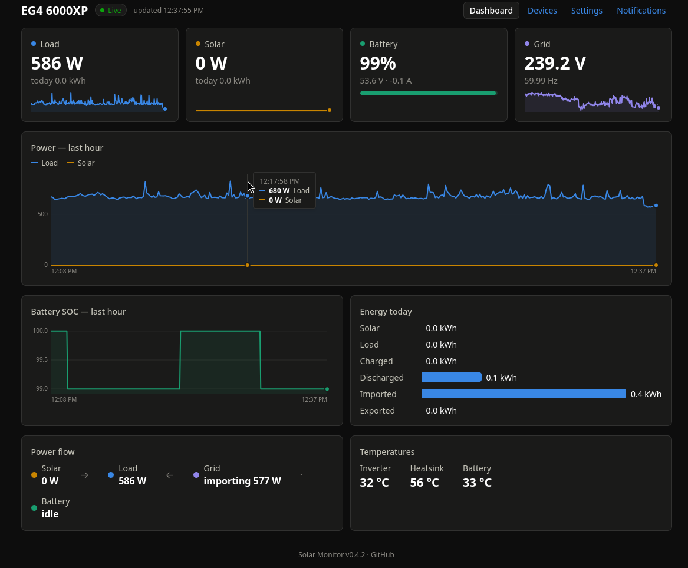
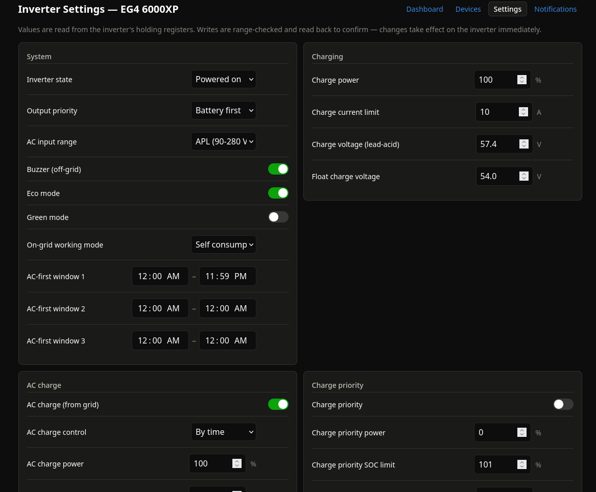
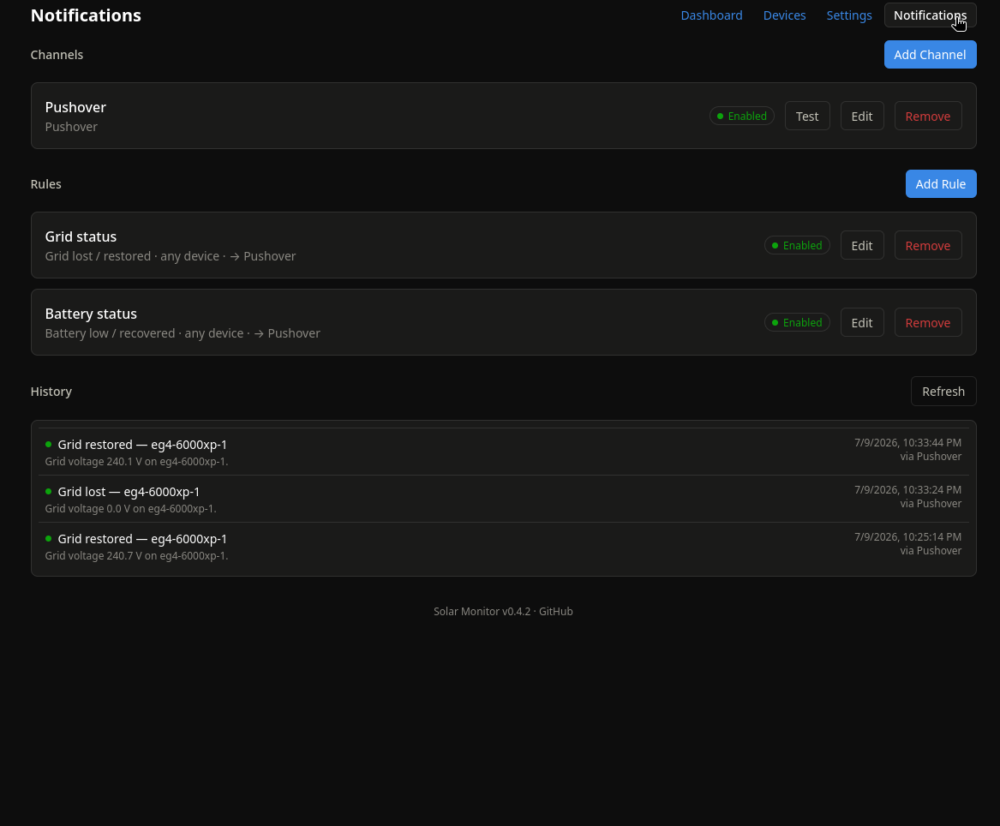

# Solar Monitor Setup

A step-by-step guide to wiring an EG4 6000XP to a Raspberry Pi and getting
Solar Monitor running. The same flow applies to any Linux SBC with a USB
port.

> **Disclaimer:** this project changes live inverter and battery settings.
> Everything here is provided as is, with no warranty — proceed carefully
> and verify any change against your inverter's documentation. See the
> [License section of the README](../README.md#license).

## Hookup Guide

I used a Waveshare USB to RS485 converter to provide the interface to a
Raspberry Pi 4. The connections here are
important, so note the colors on each pin.

For the USB adapter side, here are the mappings (T568B colors):

| Adapter terminal | Wire |
|---|---|
| B- | Brown/White |
| A+ | Brown |
| GND | Green |



I then situated my RPi on the wall within reach of the EG4 6000XP:



On the connector side, the cable is wired up in the standard T568B format.
I'm using Cat6e cable here, but Cat5 works just as nicely:



Some tools actually have the format laid out on a sticker for your
convenience, like this Klein Tools ratcheting modular data cable crimper:



The connector end gets plugged into the CT1 port (top left). The bottom
left is the battery connection — don't confuse the two: the battery comms
port reaches the battery BMS, not the inverter.



If you have a WiFi dongle, make sure it's removed — it occupies the same
port. You can then put the cover back on your EG4. If your inverter is
running, take care not to hit the breakers while re-fitting the cover.

## Software Setup

### Download a binary

Pre-compiled binaries are in the
[Releases](https://github.com/circuitdojo/solar-monitor/releases) area.
On a Raspberry Pi, choose the **aarch64** download. Unpack and copy the
binary to `/usr/local/bin/`:

```bash
tar xzf solar-monitor-v*-aarch64-unknown-linux-gnu.tar.gz
sudo cp solar-monitor /usr/local/bin/
```

(The binary must live outside `/home` — the systemd service runs with
`ProtectHome=true`.)

### Build from source

Building from source requires the Rust toolchain (<https://rustup.rs/>)
and Node.js, because the web UI is compiled into the binary. A plain
`cargo install --git ...` will **not** work — it would produce a binary
without the embedded UI. Instead:

```bash
git clone https://github.com/circuitdojo/solar-monitor.git
cd solar-monitor
(cd web && npm ci && npm run build)
cargo build --release -p solar-monitor --features solar-monitor-api/embed-frontend
sudo cp target/release/solar-monitor /usr/local/bin/
```

### Install the service

Once the binary is in place, install the systemd service:

```bash
sudo solar-monitor --install
```

This starts the application on boot and requires no further intervention
on your part.

## Software Use

The service listens on port `8080` by default, so navigate to it in your
browser:

```
http://<RPi IP ADDR>:8080
```

Then navigate to the **Devices** page:



Then click **Add Device**:



Give it a name and select the appropriate serial port. The application is
designed to follow the serial number of the RS485 adapter — if you unplug
it by accident, it will come right back when re-plugged.

If you jump back to the **Dashboard**, you should see some data!



We don't have any PV here yet, but if you do, you'll see that information
as well.

### Changing settings

Most of the known settings of the 6000XP can be changed under
**Settings**. Tune to your heart's content.



This application is still a work in progress. We haven't turned all the
knobs, but the ones we have tested seem to be working A-OK. Hardware-risky
settings (backup output voltage/frequency, charge and equalization
voltage, inverter standby) ask for confirmation before writing. Proceed
carefully when making any changes — we take no liability for damaged
inverters!

### Setting notifications

Another critical piece of the application is sending notifications. It
supports multiple notification channels (ntfy, email, Pushover, webhook) —
we prefer Pushover. Configure a channel via the **Add Channel** button:



Once configured, you can add multiple rules for when you want
notifications. I'm most interested in when the battery is low and when the
grid goes up and down — that's what's configured above.

---

I hope you've found this useful! We've built it to be expanded to other
inverters, batteries, and more. Everything is open source under the GPLv3
license. We're open to contributions from the community — happy solar
inverting!
